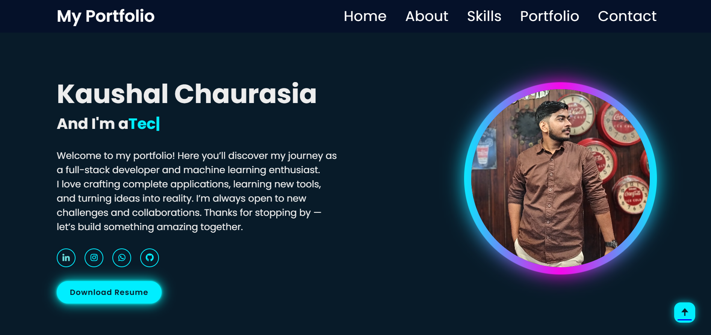

# 🌐 Personal Portfolio Website

This repository contains my **Personal Portfolio Website**, designed and developed to showcase my skills, projects, experience, and achievements as a **Full Stack Developer** and **Machine Learning Enthusiast**.

The portfolio is built with a modern UI, smooth animations, and a fully functional contact form. It serves as a central place to highlight my technical journey, real-world projects, and professional profile.

--------------------------------------------------------------

## 🚀 Live Demo

🔗 **Live Website:** https://kaushal-chaurasia.github.io/portfolio-website/ 
💻 **GitHub Repository:** https://github.com/kaushal-chaurasia/portfolio-website

----------------------------------------------------------------

## ✨ Features

- Fully responsive design (Desktop, Tablet, Mobile)
- Modern dark-themed UI with glowing effects
- Smooth scrolling and section navigation
- Typing text animation for dynamic introduction
- Skills section with animated progress indicators
- Project showcase with external links
- **Working Contact Form integrated using EmailJS**
- Resume download button
- Social media and coding profile links

--------------------------------------------------------------

## 🛠️ Tech Stack

### Frontend
- HTML5
- CSS3
- JavaScript (ES6)

### Libraries & Tools
- Typed.js (typing animation)
- Boxicons (icons)
- EmailJS (contact form email service)

### Deployment
- GitHub Pages / Netlify
----------------------------------------------------------------------

## 📂 Project Structure
portfolio-website/
│── index.html
│── stylesheet.css
│── main.js
│── images/
│── README.md
------------------------------------------------------------------
## 📈 Future Improvements

Add dark/light theme toggle

Add backend with Spring Boot / FastAPI

Store contact form responses in database

Add blog section

----------------------------------------------------------
## 🙋‍♂️ About Me

I am a final-year B.Tech student actively seeking entry-level / internship roles in:

Full Stack Development

Software Development

Machine Learning

📍 Location: Lucknow, India

📬 Connect With Me

Email: kaushalchaurasia1625@gmail.com

LinkedIn: https://www.linkedin.com/in/kaushal-chaurasia-b6a609233/

GitHub: https://github.com/kaushal-chaurasia

------------------------------------------------------------

## 📧 Contact Form Functionality

The portfolio includes a **fully working contact form** implemented using **EmailJS**, allowing visitors to send messages directly to my email without the need for a backend server.

### Contact Form Features:
- Client-side validation
- Secure email delivery using EmailJS
- Reply-to functionality (directly reply to the sender)
- User-friendly success and failure feedback

---------------------------------------------------------------

## 📸 Preview

